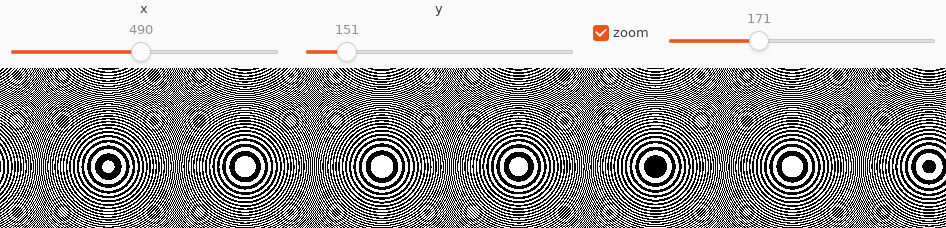
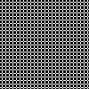
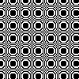
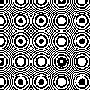
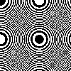
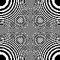
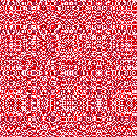

# Wallpaper

Create a wallpaper design based on the distance from a point (x,y)
truncated taken modulo 2.

This demo shows:

* Use of [gui-easy](https://docs.racket-lang.org/gui-easy/index.html)
  to create a user interface.
* A pretty low-level `for` loop in Racket to create an image.
* Calling an FFI to use a C function for the same purpose.

* Using contracts to ensure information of the correct types is passed.

The pixel (i,j) is colored according to whether the floor of

    (xcorner + i*scale)^2 + (ycorner + j*scale)^2

is even or odd.

## Quick Start

* Install the required libraries: `gui-easy`, either from DrRacket
  File -> Install Package... or via `raco pkg install gui-easy`.
* Execute `racket omnibus-gui.rkt`.
* Getting faster handling using the FFI:
  * Build the shared library using `make lib`.  Only tested
  with GCC on Linux.
  * Change the two places in `omnibus-wallpaper.rkt` that follow the
    "FFI" string in comments. This will load the shared library and
    use the C version of `wallpaper-f`.

## Quick Look at the Code

* The Racket implementation of the coloring is in
[bytefiller](bytefiller.rkt).

* The GUI is in [omnibus-gui](omnibus-gui.rkt).

* There is also [a C implementation](wallpaper.c).

## Understanding the GUI

* The x and y sliders control the coordinates of the corner.
* The scale is interpreted as n/10 when "zoom" is not checked, and
  n/2000 when "zoom" is checked.

Yes, that method is goofy, but I was experimenting with different GUI
elements.

## Example Results

The GUI produces black and white images which look quite different
depending on the scale.  These images use a corner of (0,0) and
the scale factors 0.50, 0.25, 0.21, 0.135, and 0.10.

 
 

The code actually supports the use of multiple colors. The following
image is `(paper 17.3)` with a corner of (20,30) but using red, pink,
maroon, dark red, and white.

Generated by the call:

    (wallpaper-image 200 200 20 30 17.3
                     (list "red" "pink" "maroon" "darkred" "white")))

## Interesting Problems

The Racket code accepted 15.0 as the same as 15, but the C code needed
to know the difference. This was caught by the ffi library (not the
Racket contracts).

The byte-order for a color is ARGB, but my integers are written least
significant byte first, so I needed to figure out to write the colors
in "BGRA" when I built my 4-byte integer to use to represent the
color. Testing with an opacity of 0 was especially tragic because
at first when I saw a black square I thought the code was not running correctly.

DrRacket does not re-link the shared library unless you set the
`#:custodian (current-custodian)` option in the `ffi-lib` call. This
was quite confusing during development. It would not be necessary for
the distributed version, but I left it in because it was an
interesting learning experience.

## Inspiration

_The (New) Turing Omnibus_, A.K. Dewdney, 1993. Chapter 1.
